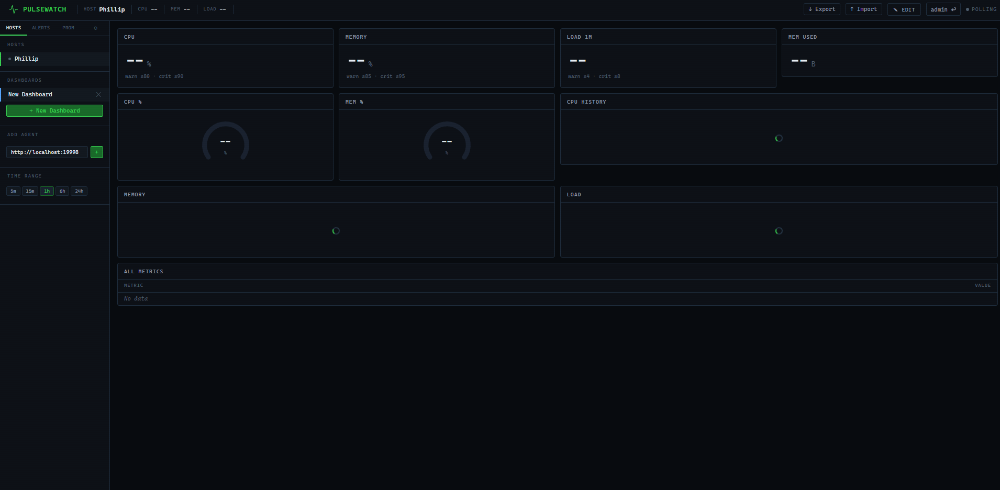

# PulseWatch v0.2.0

**Self-hosted server monitoring — starts in 30 seconds, grows with you.**



## Quick Start

```bash
# Agent on each server
./pulsewatch-agent -listen :19998

# Central server
./pulsewatch-server -listen :19999 -agents http://your-server:19998 -data ./data

# Browser → http://localhost:19999
```

## All Flags

**Server:** `-listen :19999` · `-data ./data` · `-agents http://host:19998` · `-alerts alerts.json` · `-users users.json` · `-secret changeme` · `-prom http://app:8080/metrics` · `-anomaly-window 120` · `-anomaly-threshold 3.0` · `-log info`

**Agent:** `-listen :19998` · `-interval 1s` · `-log info`

## Phases Implemented

| Phase | Feature | Status |
|---|---|---|
| 1 | Agent: /proc collectors (CPU/Mem/Disk/Net/Load), WebSocket, Prometheus endpoint | ✅ |
| 2 | Storage (hot+warm+LTTB), REST API, Agent scraper | ✅ |
| 3 | React dashboard, uplot charts, live WebSocket stream | ✅ |
| 4 | Dashboard editor: 4 widget types, drag&drop, export/import JSON | ✅ |
| 5 | Alerting: rules, state machine, Slack/Email/Webhook/Log | ✅ |
| 5 | Multi-user auth: Admin/Editor/Viewer, HMAC tokens | ✅ |
| 6 | Anomaly detection: Z-Score per metric, widget badges | ✅ |
| 6 | Prometheus scraping: text format parser, configurable targets | ✅ |
| 6 | Plugin system: external programs output JSON metrics | ✅ |

## Alert Rules (alerts.json)

```json
{
  "alerts": [
    {"name":"High CPU","host":"*","metric":"cpu.usage_percent","op":">","threshold":90,"for":"5m","severity":"critical","notify":["slack"],"enabled":true}
  ],
  "channels": {
    "slack":   {"type":"slack","webhook_url":"https://hooks.slack.com/..."},
    "email":   {"type":"email","smtp_host":"smtp.example.com","smtp_port":587,"from":"alerts@example.com","to":["ops@example.com"]},
    "webhook": {"type":"webhook","webhook_url":"https://your-endpoint/alerts"},
    "log":     {"type":"log"}
  }
}
```

## Plugin Example

```python
#!/usr/bin/env python3
import json
print(json.dumps({
    "docker.containers": 5.0,
    "service.nginx": 1.0,
}))
```

## API

`GET /api/v1/status` · `GET /api/v1/hosts` · `GET /api/v1/query?host=&metric=&from=&points=`
`GET /api/v1/alerts/active` · `GET /api/v1/alerts/history` · `GET /api/v1/anomalies`
`GET/POST /api/v1/prom/targets` · `POST /api/v1/auth/login` · `WS /api/v1/stream`

## Zero External Dependencies

Pure Go stdlib only. Single static binaries. No CGO.
